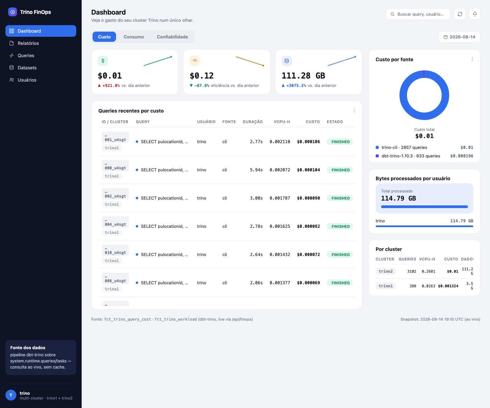

*[Leia em português](README.md)*

# trino_cost_pipeline

dbt (dbt-trino) pipeline that estimates the **USD cost and vCPU-hours of every query executed on a Trino cluster**, based on the coordinator's system tables (`system.runtime.queries` / `system.runtime.tasks`) and a seed with the cluster's machine shape/price.

## Context and motivation

`system.runtime.queries` and `system.runtime.tasks` are **ephemeral snapshots**: retention is controlled by `query.min-expire-age` (default 15 min in Trino) and `query.max-history` (default 100). This imposes two constraints on the pipeline:

- It **must run more frequently** than `query.min-expire-age`, otherwise queries get evicted from the coordinator before being captured — and that loss is **permanent**, there is no reprocessing possible after eviction.
- Since a row can become visible in the system table a bit after the `end` timestamp it carries, every run re-reads the **entire retention window** (not just what's strictly new since the last capture). That's why the incremental models use `incremental_strategy='merge'` instead of `append` — to avoid duplicating already-captured records.

The `query_min_expire_age_minutes` variable in [dbt_project.yml](dbt_project.yml) should mirror the `query.min-expire-age` configured on the Trino coordinator, and is used both as a scheduling guideline and as the incremental lookback window.

## Layered architecture

| Layer | Role |
|---|---|
| **staging** | 1:1 translation of the `system.runtime.queries`/`tasks` schema, isolating the rest of the project from schema changes across Trino versions. Only captures queries in a terminal state (`FINISHED`/`FAILED`). |
| **intermediate** | Computes CPU/vCPU and I/O consumption per query, the cluster's `$/vCPU-hour` rate (from the `cluster_shape` seed), and an approximation of real concurrency via a self-join of overlapping intervals. |
| **marts** | Cost fact per query, workload fact (trend/usage/errors), daily ranking/percentage, and cluster processing growth views (daily/monthly). |

## Models

| Model | Layer | Materialization | Description |
|---|---|---|---|
| `stg_trino__queries` | staging | incremental · append | Terminal queries (`FINISHED`/`FAILED`), translated schema. |
| `stg_trino__tasks` | staging | incremental · append | Finished tasks (`FINISHED`): CPU time, scheduled time, and I/O (bytes/rows) per task. |
| `int_trino_query_cpu_usage` | intermediate | view | Sums tasks' CPU time per query → `vcpu_hours`. |
| `int_trino_query_io_usage` | intermediate | view | Sums tasks' scheduled time and input/output bytes/rows per query. |
| `int_cluster_vcpu_rate` | intermediate | view | `$/vCPU-hour` rate derived from the cluster's shape (seed), not market price. |
| `int_trino_query_vcpu_rate` | intermediate | incremental · merge · partitioned by `query_date` | Average vCPU rate per query (`vcpu_hours / duration`). |
| `int_trino_query_concurrent_vcpu_usage` | intermediate | incremental · merge · partitioned by `query_date` | Sums, per query, the average vCPU rate of every query on the same cluster whose execution interval overlaps with it (approximation of real concurrency). |
| `fct_trino_query_cost` | mart | incremental · merge | Estimated cost per query (`query_id` + `cluster_id`), in vCPU-hours and USD, with % of cluster capacity consumed (average variant and concurrent variant). |
| `fct_trino_workload` | mart | incremental · merge | Workload metrics per query (elapsed/queued/scheduled time, I/O, error) — equivalent to the [Presto/Trino Workload Analyzer](https://github.com/varadaio/presto-workload-analyzer), computed solely from `system.runtime.*` (no need for the `/v1/query` API). Does not cover per-operator/plan metrics (join, filter selectivity, table scanned), which `system.runtime.*` doesn't expose. |
| `fct_trino_query_daily_rank` | mart | view | Daily ranking of cost/vCPU-hours and % of daily total, partitioned by `cluster_id` + `query_date`. |
| `fct_trino_cluster_growth_daily` | mart | view | Daily processing growth per cluster: queries, vCPU-hours, cost, bytes read, and **cost per TB processed** (`cost_usd_per_tb`), with day-over-day % change (`LAG()`). |
| `fct_trino_cluster_growth_monthly` | mart | view | Same analysis as `fct_trino_cluster_growth_daily`, aggregated by month, with month-over-month % change. |

## Lineage


## Seed: `cluster_shape`

Defines each cluster's machine shape and price, used to derive the `$/vCPU-hour` rate:

```
cluster_id,node_role,instance_type,vcpus,hourly_price_usd,node_count,valid_from
default,coordinator,r6i.4xlarge,16,1.008,1,2026-01-01
default,worker,r6i.4xlarge,16,1.008,10,2026-01-01
```

> **Known limitation:** `int_cluster_vcpu_rate` assumes a homogeneous, static shape per `node_role`. If the cluster autoscales or changes `instance_type` over time, the seed needs to be versioned with `valid_from`/`valid_to` ranges and the model needs to filter by the period in effect instead of aggregating the current row — this isn't implemented yet.

## FinOps dashboard

[scripts/finops_server.py](scripts/finops_server.py) serves a static dashboard ([scripts/finops_dashboard.html](scripts/finops_dashboard.html), plain HTML/JS) and exposes `/api/finops`, which queries Trino live (`iceberg.billing.*`) on every request — no cache, always reflecting the current state of the marts. Multi-cluster: aggregates `fct_trino_query_cost`/`fct_trino_workload` by `cluster_id` and `user_name`, with a dedicated user ranking page.



```bash
docker build -t trino-finops-dashboard scripts/
docker run --rm -p 5050:5050 \
    -e TRINO_HOST=host.docker.internal \
    -e TRINO_PORT=8080 \
    trino-finops-dashboard
# opens at http://localhost:5050
```

## Configuration

```yaml
vars:
  cluster_id: "default"                 # override per environment: dbt run --vars '{cluster_id: prod-a}'
  query_min_expire_age_minutes: 15       # should mirror query.min-expire-age on the Trino coordinator
```

The staging and mart models use `file_format: parquet` (Iceberg's file format — `iceberg` isn't a valid value here, it's the table format given by the catalog); adjust the destination catalog/schema in `profiles.yml` (not included in this repository).

## How to run

```bash
dbt deps        # if any packages are configured
dbt seed
dbt run --vars '{cluster_id: prod-a}'
dbt test
```

Scheduling (cron/orchestrator) must run more frequently than `query_min_expire_age_minutes`.

## Tests and known limitations

- `not_null` on `query_id`, `cluster_id`, `vcpu_hours`, and `estimated_cost_usd` of `fct_trino_query_cost` ([_marts__models.yml](models/marts/_marts__models.yml)).
- The composite primary key (`query_id`, `cluster_id`) should have a combined-uniqueness test, but that requires `dbt_utils.unique_combination_of_columns` — the project doesn't depend on `dbt_utils` today.
- `int_trino_query_concurrent_vcpu_usage` restricts the self-join to the `query_date` partition(s) being processed to avoid an O(n²) scan over the entire history. Trade-off: queries that cross midnight aren't compared against queries from the previous/next day even when their intervals actually overlap.
