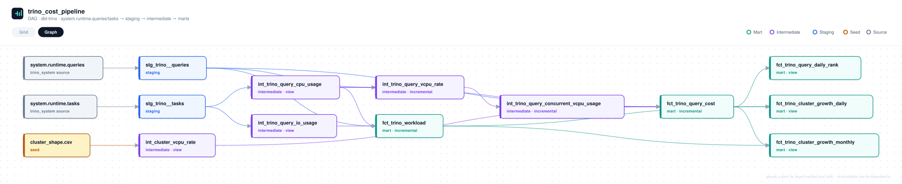

# trino_cost_pipeline

Pipeline dbt (dbt-trino) que estima o **custo em USD e vCPU-horas de cada query executada em um cluster Trino**, a partir das tabelas de sistema do coordinator (`system.runtime.queries` / `system.runtime.tasks`) e de um seed com o shape/preço das máquinas do cluster.

## Contexto e motivação

`system.runtime.queries` e `system.runtime.tasks` são **snapshots efêmeros**: a retenção é controlada por `query.min-expire-age` (padrão 15 min no Trino) e `query.max-history` (padrão 100). Isso impõe duas restrições ao pipeline:

- Ele **precisa rodar com frequência menor** que `query.min-expire-age`, senão queries são evictadas do coordinator antes de serem capturadas — e essa perda é **permanente**, não há reprocessamento possível depois da eviction.
- Como uma linha pode ficar visível na tabela de sistema um pouco depois do timestamp `end` que ela carrega, cada execução relê a **janela de retenção inteira** (não só o que é estritamente novo desde a última captura). Por isso os modelos incrementais usam `incremental_strategy='merge'` em vez de `append` — para não duplicar registros já capturados.

A variável `query_min_expire_age_minutes` em [dbt_project.yml](dbt_project.yml) deve espelhar o `query.min-expire-age` configurado no coordinator Trino, e é usada tanto como guia de agendamento quanto como janela de lookback incremental.

## Arquitetura em camadas

| Camada | Papel |
|---|---|
| **staging** | Tradução 1:1 do schema de `system.runtime.queries`/`tasks`, isolando o resto do projeto de mudanças de schema entre versões do Trino. Só captura queries em estado terminal (`FINISHED`/`FAILED`). |
| **intermediate** | Cálculo de consumo de CPU/vCPU e I/O por query, taxa `$/vCPU-hora` do cluster (a partir do seed `cluster_shape`) e aproximação de concorrência real via self-join de intervalos sobrepostos. |
| **marts** | Fato de custo por query, fato de workload (tendência/uso/erros), ranking/percentual diário e visões de crescimento de processamento por cluster (diária/mensal). |

## Modelos

| Modelo | Camada | Materialização | Descrição |
|---|---|---|---|
| `stg_trino__queries` | staging | incremental · append | Queries terminais (`FINISHED`/`FAILED`), schema traduzido. |
| `stg_trino__tasks` | staging | incremental · append | Tasks finalizadas (`FINISHED`): CPU time, scheduled time e I/O (bytes/rows) por task. |
| `int_trino_query_cpu_usage` | intermediate | view | Soma o CPU time das tasks por query → `vcpu_hours`. |
| `int_trino_query_io_usage` | intermediate | view | Soma scheduled time e bytes/rows de input/output das tasks por query. |
| `int_cluster_vcpu_rate` | intermediate | view | Taxa `$/vCPU-hora` derivada do shape do cluster (seed), não de preço de mercado. |
| `int_trino_query_vcpu_rate` | intermediate | incremental · merge · particionado por `query_date` | Taxa média de vCPU por query (`vcpu_hours / duração`). |
| `int_trino_query_concurrent_vcpu_usage` | intermediate | incremental · merge · particionado por `query_date` | Soma, por query, a taxa média de vCPU de todas as queries do mesmo cluster cujo intervalo de execução se sobrepõe ao dela (aproximação de concorrência real). |
| `fct_trino_query_cost` | mart | incremental · merge | Custo estimado por query (`query_id` + `cluster_id`), em vCPU-horas e USD, com % de capacidade do cluster consumida (variante média e variante concorrente). |
| `fct_trino_workload` | mart | incremental · merge | Métricas de workload por query (elapsed/queued/scheduled time, I/O, erro) — equivalente ao [Presto/Trino Workload Analyzer](https://github.com/varadaio/presto-workload-analyzer), calculado só a partir de `system.runtime.*` (sem precisar da API `/v1/query`). Não cobre métricas por operador/plano (join, seletividade de filtro, tabela escaneada), que `system.runtime.*` não expõe. |
| `fct_trino_query_daily_rank` | mart | view | Ranking diário de custo/vCPU-horas e % do total diário, particionado por `cluster_id` + `query_date`. |
| `fct_trino_cluster_growth_daily` | mart | view | Crescimento diário de processamento por cluster: queries, vCPU-horas, custo, bytes lidos e **custo por TB processado** (`cost_usd_per_tb`), com variação % dia a dia (`LAG()`). |
| `fct_trino_cluster_growth_monthly` | mart | view | Mesma análise de `fct_trino_cluster_growth_daily`, agregada por mês, com variação % mês a mês. |

## Linhagem



## Seed: `cluster_shape`

Define o shape e o preço das máquinas de cada cluster, usado para derivar a taxa `$/vCPU-hora`:

```
cluster_id,node_role,instance_type,vcpus,hourly_price_usd,node_count,valid_from
default,coordinator,r6i.4xlarge,16,1.008,1,2026-01-01
default,worker,r6i.4xlarge,16,1.008,10,2026-01-01
```

> **Limitação conhecida:** `int_cluster_vcpu_rate` assume um shape homogêneo e estático por `node_role`. Se o cluster faz autoscaling ou troca de `instance_type` ao longo do tempo, o seed precisa ser versionado com faixas `valid_from`/`valid_to` e o modelo passar a filtrar pelo período vigente em vez de agregar a linha atual — isso ainda não está implementado.

## Configuração

```yaml
vars:
  cluster_id: "default"                 # sobrescreva por ambiente: dbt run --vars '{cluster_id: prod-a}'
  query_min_expire_age_minutes: 15       # deve espelhar query.min-expire-age do coordinator Trino
```

Os modelos de staging e mart usam `file_format: parquet` (formato de arquivo do Iceberg — `iceberg` não é um valor válido aqui, é o formato de tabela dado pelo catalog); ajuste catalog/schema de destino no `profiles.yml` (não incluso neste repositório).

## Como rodar

```bash
dbt deps        # se houver packages configurados
dbt seed
dbt run --vars '{cluster_id: prod-a}'
dbt test
```

O agendamento (cron/orquestrador) deve rodar com frequência **menor** que `query_min_expire_age_minutes`.

## Testes e limitações conhecidas

- `not_null` em `query_id`, `cluster_id`, `vcpu_hours` e `estimated_cost_usd` de `fct_trino_query_cost` ([_marts__models.yml](models/marts/_marts__models.yml)).
- A chave primária composta (`query_id`, `cluster_id`) deveria ter um teste de unicidade combinada, mas isso exige `dbt_utils.unique_combination_of_columns` — o projeto não depende de `dbt_utils` hoje.
- `int_trino_query_concurrent_vcpu_usage` restringe o self-join à(s) partição(ões) de `query_date` sendo processada(s) para evitar scan O(n²) sobre todo o histórico. Trade-off: queries que atravessam a virada do dia não são comparadas com queries do dia anterior/seguinte mesmo que os intervalos se sobreponham de fato.
